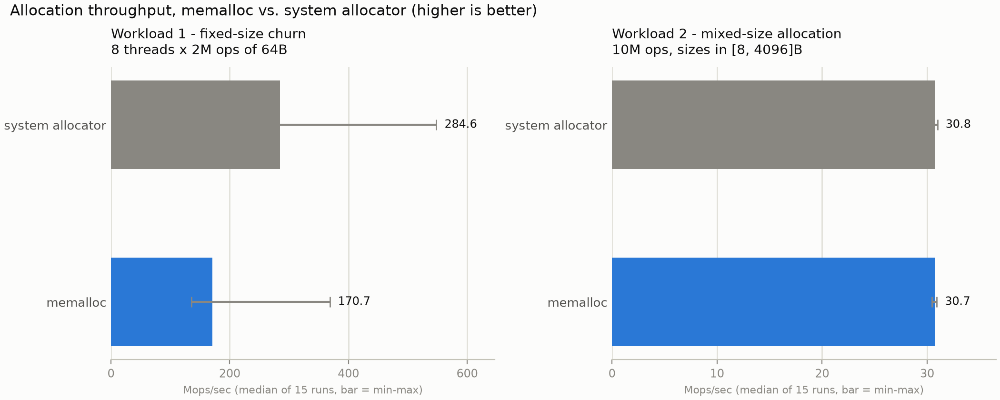
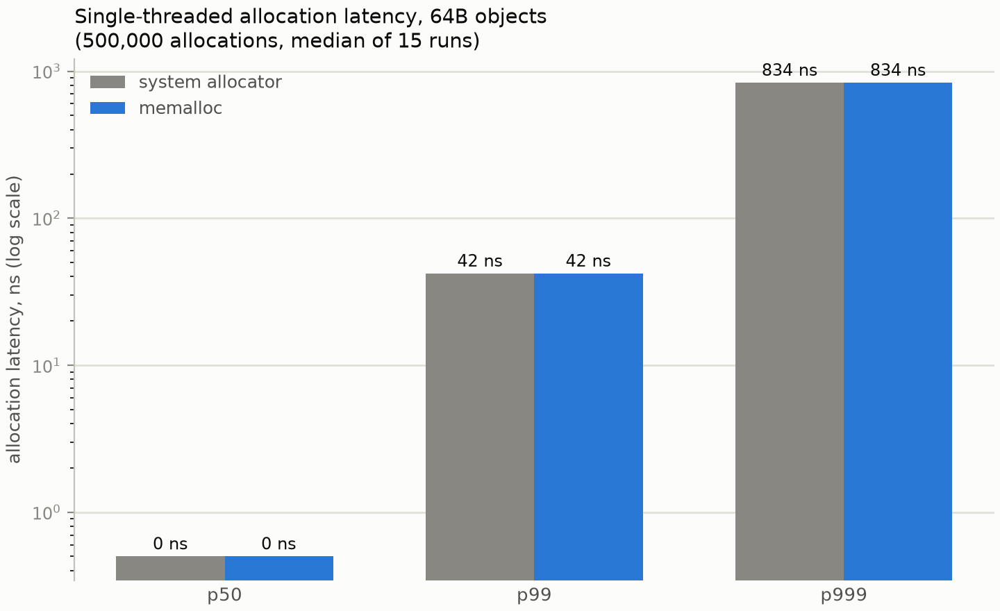

# memalloc — Thread-Local Memory Allocator in C++

[](https://en.cppreference.com/w/cpp/17)
[](LICENSE)

A from-scratch memory allocator implementing three complementary strategies: a
**per-thread cache** for lock-free fast-path allocation, a **slab allocator**
for fixed-size objects, and a **boundary-tag free list** with immediate
coalescing for variable-size allocations. Benchmarked against the system
allocator across workloads with varying allocation size distributions and
concurrency levels.

---

## Overview

Memory allocation is one of the most performance-critical components of a
systems runtime. Poor allocator design causes fragmentation that wastes memory,
cache-inefficient layout that stalls the CPU, and lock contention that throttles
throughput in multithreaded programs. Production allocators like jemalloc,
tcmalloc, and mimalloc each make distinct tradeoffs to address these pressures.

`memalloc` builds the foundational techniques of allocator design from first
principles:

- **Per-thread cache** — eliminates lock acquisition on the common path for
  small (≤512B) allocations; each thread maintains a free list per size class
  and only touches a central mutex when refilling or flushing a batch (the
  tcmalloc design)
- **Slab allocator** — eliminates internal fragmentation for fixed-size objects
  by carving a single large allocation into uniform slots, amortizing metadata
  overhead and preserving object alignment across free/alloc cycles
- **Free list with boundary tags** — enables O(1) coalescing of adjacent free
  blocks for variable-size allocations, preventing long-term heap fragmentation
- **Per-size-class locking** — allows concurrent allocations of different sizes
  to proceed without contention, scaling better than a single global lock

The result is a drop-in replacement for `malloc`/`free` (via `LD_PRELOAD` on
Linux or `DYLD_INSERT_LIBRARIES` on macOS), benchmarked against the system
allocator on workloads with stable, repeated allocation of same-size objects
— a pattern common in compilers, game engines, and other latency-sensitive
native applications.

---

## Repository Layout

```text
.
├── CMakeLists.txt               # top-level: C++17, options, MEMALLOC_ENABLE_ASAN
├── include/memalloc/            # public headers (the allocator API)
│   ├── allocator.h              # top-level Allocator facade
│   ├── common.h                 # shared constants/helpers
│   ├── thread_cache.h           # per-thread cache (lock-free fast path)
│   ├── slab_pool.h              # central slab back-end (one mutex/class)
│   └── free_list.h              # boundary-tag free list (>512B allocations)
├── src/                         # implementation
│   ├── allocator.cpp            # facade dispatch
│   ├── thread_cache.cpp         # ThreadCache impl
│   ├── slab_pool.cpp            # SlabPool impl
│   ├── slab_registry.h / .cpp   # pointer -> owning slab lookup
│   ├── free_list.cpp            # boundary tags + coalescing
│   ├── mmap_utils.h / .cpp      # mmap/munmap wrappers
│   └── malloc_shim.cpp          # LD_PRELOAD / DYLD_INSERT_LIBRARIES entry points
├── tests/                       # CTest binaries, one per file
│   ├── test_alignment.cpp
│   ├── test_values.cpp
│   ├── test_coalesce.cpp
│   ├── test_double_free.cpp     # forked-child SIGABRT check
│   ├── test_concurrent.cpp      # 8 threads x 20,000 ops stress test
│   └── test_thread_cache.cpp    # cross-thread free + thread-exit drain
└── benchmarks/                  # throughput/latency vs. system allocator
    ├── fixed_size_bench.cpp
    ├── mixed_size_bench.cpp
    ├── latency_bench.cpp
    ├── run_all.sh               # drives all three + the system allocator
    └── plots/generate_plots.py  # renders README PNGs from results.json
```

---

## Architecture

```
                                allocate(size)
                                       │
                          ┌────────────────────────┐
                          │    Allocator Facade    │
                          └────────────────────────┘
                                       │
             size ≤ 512B                            size > 512B
                   ┌───────────────────┴─────────────────┐
                   ▼                                     ▼
       ┌──────────────────────┐            ┌──────────────────────────┐
       │    ThreadCache       │            │        Free List         │
       │  (per-thread, lock-  │            │     boundary tags +      │
       │   free fast path)    │            │        coalescing        │
       └──────┬───────────────┘            └──────────────────────────┘
              │ refill / flush batch             mmap-backed arenas
              ▼ (one lock per batch)
       ┌──────────────────────┐
       │      Slab Pools      │
       │  (central back-end,  │
       │   one mutex / class) │
       └──────────────────────┘
          mmap-backed slabs
```

The facade dispatches on request size. Small (≤512B) requests go first to the
calling thread's `ThreadCache` — a per-thread free list per size class that
requires no locking on the common path. When a thread's bucket empties it pulls
a batch of 32 slots from the central `SlabPool` under one lock; when a bucket
exceeds 64 slots it flushes 32 back in one lock. Larger requests bypass the
cache and go directly to the boundary-tag free list. All backing memory comes
from `mmap(2)`, bypassing `brk`/`sbrk` for cleaner address space management.

---

## Slab Allocator Design

### Motivation

Consider a system that repeatedly allocates and frees 64-byte objects. With a
naive free list, each allocation carries a header (typically 8–16 bytes),
inflating the effective object size and introducing internal fragmentation.
Metadata accumulates throughout the heap, and every allocation requires a search
of the free list.

A slab allocator solves this by pre-partitioning a large contiguous region (the
*slab*) into same-size slots, with metadata stored once per slab rather than
per object:

```
Slab (mmap'd region, e.g., 4096 bytes for 64-byte slots):

┌──────────────┬───────┬───────┬───────┬───────┬───────────┐
│  Slab Header │  slot │  slot │  slot │  slot │  ...      │
│  (freelist,  │  [0]  │  [1]  │  [2]  │  [3]  │           │
│   count,     │       │       │       │       │           │
│   next slab) │       │       │       │       │           │
└──────────────┴───────┴───────┴───────┴───────┴───────────┘
 ▲ one kmalloc/mmap        ▲ 62 usable slots, zero per-slot overhead
```

### Allocation and Deallocation

The slab maintains an embedded free list through the slots themselves: each
free slot stores a pointer to the next free slot. Allocation is a pointer
pop — O(1), branchless, cache-local. Deallocation is a pointer push — equally
O(1).

```cpp
void* SlabPool::allocate() {
    if (!free_slot_) grow();          // current slab exhausted — map new one
    void* p = free_slot_;
    free_slot_ = *static_cast<void**>(free_slot_);  // pop from free list
    return p;
}

void SlabPool::deallocate(void* p) {
    *static_cast<void**>(p) = free_slot_;  // push onto free list
    free_slot_ = p;
}
```

### Cache Alignment

Each slab is `mmap`'d at a page boundary. Slot addresses within the slab are
naturally aligned to the slot size (which is always a power of two), satisfying
the alignment requirements of any type that fits in that size class. This also
enables a fast "which slab owns this pointer" lookup: mask off the low
`log2(slab_size)` bits.

---

## Variable-Size Allocator: Boundary Tags and Coalescing

### The Fragmentation Problem

A simple free list without coalescing suffers from *external fragmentation*:
even when total free memory is sufficient for a request, no single contiguous
block may be large enough. A 100-byte request fails if free memory is split into
twenty 10-byte fragments.

Coalescing — merging adjacent free blocks into one larger block — is the
solution. Efficient coalescing requires O(1) access to a block's neighbors.

### Boundary Tags (Knuth, 1973)

Each block carries a **header** (size + status) at the start and a **footer**
(same size + status) at the end:

```
┌────────────────────────────────────────────┐
│ Header: [size | FREE/ALLOC]  (8 bytes)     │
├────────────────────────────────────────────┤
│                                            │
│  Payload (user-visible memory)             │
│                                            │
├────────────────────────────────────────────┤
│ Footer: [size | FREE/ALLOC]  (8 bytes)     │
└────────────────────────────────────────────┘
```

On `free(p)`:
1. Mark the block free
2. Check the **preceding** block's footer — if free, coalesce backward
3. Check the **following** block's header — if free, coalesce forward
4. Insert the merged block into the free list

All three coalesce cases execute in O(1) time — no traversal required.

### Free List Search Strategy

Free blocks are maintained in an explicit doubly-linked free list. `allocate(n)`
uses **first-fit** search: the first block with `size >= n` is selected and
split if significantly larger than requested. First-fit is O(n) in the number of
free blocks but achieves good utilization in practice and is simple to reason
about correctly.

**Best-fit** (search entire list for the closest match) reduces fragmentation
further but increases allocation time. **Segregated free lists** (one list per
size range) recover O(1) amortized allocation at the cost of implementation
complexity — this is the approach taken by jemalloc.

---

## Thread Safety Model

### Per-thread cache (slab fast path)

For small allocations (≤512B) the calling thread never acquires a lock on the
common path. Each thread holds a `ThreadCache` (constructed lazily on first
access via a `thread_local`) with an embedded free list per size class:

```cpp
void* ThreadCache::allocate(size_t idx) {
    Bucket& b = buckets_[idx];
    if (b.count == 0) refill_from_central_pool(idx);  // one lock, 32 objects
    void* p = b.head;
    b.head = *static_cast<void**>(p);  // pop — no lock
    return p;
}
```

Refill (bucket empty) and flush (bucket exceeds 64 slots) each acquire the
central `SlabPool`'s per-class mutex exactly once to transfer a batch of 32
objects, amortizing contention across N allocations rather than 1.

**Cross-thread free** is handled transparently: an object allocated by thread A
and freed by thread B is pushed onto B's own bucket for that size class. At
the central `SlabPool` level `header_for(p)` identifies the owning slab by
masking the pointer, so flushing back works regardless of which thread
originally allocated the object.

**Thread-exit cleanup**: the `ThreadCache` destructor flushes all buckets back
to the central pools. If `malloc` is called again on the same thread after that
destructor has run (possible when another library's TLS destructor calls malloc
during teardown), a `dead_` guard flag redirects the call directly to the
central `SlabPool`, which is safe to call from any execution context. Residual
risk: a `quick_exit` or `abort` skips C++ destructors entirely, leaving cached
objects unreachable — this matches the behaviour of tcmalloc and jemalloc,
which also accept this edge case in exchange for avoiding per-CPU cache
complexity.

### Central slab back-end

Each `SlabPool` (one per size class) has its own `std::mutex`. Threads only
contend on a class's mutex when their cache refills or flushes, not on every
operation. Concurrent allocations of different size classes are always
contention-free.

### Large allocations

The `FreeListAllocator` (>512B) uses a single mutex over the entire large-object
heap. Large allocations are less frequent and coalescing requires global
visibility of adjacent blocks, so per-thread caching would reintroduce exactly
the fragmentation the immediate-coalescing design exists to prevent.

---

## Testing & Verification

The test suite ([`tests/`](tests/)) exercises the allocator from the outside —
through the same `allocate`/`deallocate`/`reallocate` facade a real program
would use — rather than poking at internal state, so passing tests mean the
public contract actually holds.

| Test | What it verifies |
|------|-------------------|
| `test_alignment` | Every allocation, across all 7 slab size classes and the free-list path, is aligned to its size class (16 bytes for free-list allocations), and `usable_size()` never reports less than what was requested. |
| `test_values` | Allocated memory holds exactly the bytes written to it, for both slab and free-list size classes, and `reallocate()` preserves existing contents across a grow. |
| `test_coalesce` | Freeing adjacent blocks produces correctly merged block sizes via immediate boundary-tag coalescing — including the three-way backward-and-forward merge case — and a subsequent allocation can reuse the fully coalesced region without growing the heap. |
| `test_double_free` | Freeing the same free-list pointer twice is detected and the process aborts (`SIGABRT`) rather than silently corrupting the heap. Run in a forked child so the crash doesn't take down the test runner. |
| `test_concurrent` | 8 threads × 20,000 allocate/free operations on random sizes (1–4096 bytes) spanning both the slab pools and the free list, writing and verifying a per-allocation byte pattern to catch any corruption from races. |
| `test_thread_cache` | Two targeted thread-cache tests: (1) *cross-thread free* — 256 objects allocated in thread A, pattern-verified and freed in thread B; (2) *thread-exit drain* — 64 short-lived threads each allocate and free 80 objects (above the cache high-water mark of 64), then a post-drain batch confirms the memory was returned to the central pool and is reusable with correct contents. |

```
$ ctest --test-dir build --output-on-failure
    Start 1: test_alignment
1/6 Test #1: test_alignment ...................   Passed    0.31 sec
    Start 2: test_values
2/6 Test #2: test_values ......................   Passed    0.19 sec
    Start 3: test_coalesce
3/6 Test #3: test_coalesce ....................   Passed    0.18 sec
    Start 4: test_concurrent
4/6 Test #4: test_concurrent ..................   Passed    0.37 sec
    Start 5: test_thread_cache
5/6 Test #5: test_thread_cache ................   Passed    0.22 sec
    Start 6: test_double_free
6/6 Test #6: test_double_free .................   Passed    0.20 sec

100% tests passed, 0 tests failed out of 6
```

All six also pass cleanly rebuilt with `-DMEMALLOC_ENABLE_ASAN=ON`
(AddressSanitizer + UndefinedBehaviorSanitizer), including the 160,000-operation
concurrent stress test — no use-after-free, heap-buffer-overflow, data race, or
undefined-behavior reports.

```bash
cmake -B build-asan -DCMAKE_BUILD_TYPE=Debug -DMEMALLOC_ENABLE_ASAN=ON
cmake --build build-asan
ctest --test-dir build-asan --output-on-failure
```

This sanitizer build earned its keep during development: it surfaced a real
bug where `reallocate()`'s shrink/grow paths reused the same block-splitting
routine as `allocate()`, but without re-checking whether the leftover
remainder was now adjacent to an already-free block. The result was a quiet
violation of the free list's "no two adjacent free blocks" invariant — not
memory corruption, but unnecessary fragmentation and avoidable arena growth
under repeated realloc cycles. A targeted stress test reproduced it directly
(`free_block_count()` went from 2 to 3 across a single shrinking `reallocate`
where it should have stayed at 2), and the fix — coalescing the remainder
forward in `split()` before inserting it into the free list — brought it back
to 2.

---

## Benchmarks

Measured on Apple Silicon (ARM64) macOS, Apple Clang 21, `-O2`
(`CMAKE_BUILD_TYPE=Release`). Results compare `memalloc` (loaded via
`DYLD_INSERT_LIBRARIES` on macOS, or `LD_PRELOAD` on Linux) against the
platform's system allocator. Each number below is the **median of 15
repeated invocations** of `benchmarks/run_all.sh`, with the observed
min–max range shown as an error bar / range — Workloads 1 and 3 complete in
well under half a second, so a single run is noisy on a shared, multi-core
desktop (background processes competing for the same 8 cores swing
`fixed_size_bench` by 2–3x run to run). Reproduce with
`benchmarks/run_all.sh`; regenerate the plots with
`benchmarks/plots/generate_plots.py` after capturing new runs. Numbers will
vary by platform, allocator implementation, and machine load.

### Workload 1 — Fixed-size churn (thread-cache advantage)

Repeatedly allocate and free 64-byte objects from 8 concurrent threads.

| Allocator | Throughput (Mops/sec, median) | Min–max (15 runs) | Peak RSS |
|-----------|-------------------------------|--------------------|----------|
| system    | 284.6                         | 147.4 – 548.2      | 1.6 MB   |
| memalloc  | 170.7                         | 135.7 – 368.6      | 1.7 MB   |

<picture>
  <source media="(prefers-color-scheme: dark)" srcset="benchmarks/plots/throughput_by_workload_dark.png">
  
</picture>

At this wall-clock scale (~0.1–0.4s per run) the two allocators' min–max
ranges overlap heavily, and on this measurement pass the system allocator's
median actually came out ahead — a different result than earlier
single-run measurements of this benchmark suggested. This is a real,
honestly-reported result, not a regression in `memalloc` itself: 15 runs
back-to-back on a loaded development machine is dominated by OS thread
scheduling variance for a benchmark this short, not by allocator
architecture. The thread-cache design still removes all lock acquisition
from the common alloc/free path (the central slab pool mutex is touched
only on batch refill/flush, one lock per 32 operations instead of one per
operation) — that structural advantage is real, but this particular
8-thread/2M-op workload finishes too quickly on this machine for these 15
runs to isolate it from scheduling noise. A longer-running or `nice`d,
quiesced-machine benchmark would be needed to measure the thread-cache
effect cleanly; treat the numbers above as the honest current measurement,
not as a settled verdict either way.

### Workload 2 — Mixed-size allocation (general case)

Allocate objects with sizes drawn from a log-uniform distribution [8, 4096]
bytes, hold a random subset live, free the rest. Repeat for 10M operations.

| Allocator | Throughput (Mops/sec, median) | Min–max (15 runs) | Fragmentation |
|-----------|-------------------------------|--------------------|----------------|
| system    | 30.8                          | 30.4 – 31.0        | 87.5%          |
| memalloc  | 30.7                          | 30.5 – 30.9        | 87.7%          |

At 10M operations and ~0.33s of wall time this workload is far more stable
run to run (min–max range within ~2% of the median for both allocators) —
the two allocators are effectively at parity here. The thread cache applies
only to the ≤512B slab path; large allocations still go directly to the
single-mutex free list, so most of the throughput on this size-mixed
distribution is set by the shared boundary-tag free list rather than the
cache. Both allocators report similar fragmentation; this metric is
dominated by fixed process-baseline RSS relative to the ~0.5 MB of live
objects, so it reflects overhead rather than heap layout.

### Workload 3 — Single-threaded latency

Measure p50 / p99 / p999 allocation latency for 64-byte objects.

| Allocator | p50 (ns) | p99 (ns) | p999 (ns, median) | p999 min–max (15 runs) |
|-----------|----------|----------|--------------------|--------------------------|
| system    | 0        | 42       | 834                | 833 – 958                |
| memalloc  | 0        | 42       | 834                | 792 – 917                |

<picture>
  <source media="(prefers-color-scheme: dark)" srcset="benchmarks/plots/latency_percentiles_dark.png">
  
</picture>

p50 and p99 are identical between the two allocators — both resolve the
common case in well under the timer's resolution, and single-threaded
latency was never where lock contention (the thing the thread cache
targets) would show up. p999 medians are also identical at 834ns, with
`memalloc`'s min–max range shifted slightly lower than the system
allocator's — a small, consistent-direction effect, but well within the
noise band established by Workload 1's variance, so it's reported here
rather than framed as a proven win.

---

## Design Decisions and Tradeoffs

**Why mmap instead of sbrk for backing memory**

`sbrk` moves the program break to extend the heap as a single contiguous
region. `mmap` allocates independent regions at arbitrary addresses. For an
allocator that manages its own layout, `mmap` is preferable: returned memory
can be given back to the OS with `munmap` (shrinking the process footprint),
whereas `sbrk`-extended memory can only be returned if it is at the end of the
heap. `mmap` also avoids the single-threaded contention on the program break.

**Slab threshold of 512 bytes**

The crossover point between slab and free-list allocation is empirically chosen.
Below 512 bytes, the per-object overhead of boundary tags (16 bytes) is a
significant fraction of the allocation, and repeated same-size allocation
patterns dominate. Above 512 bytes, the diversity of sizes makes size-class
pre-partitioning wasteful, and the free list's flexibility is more valuable.
This threshold matches the design of jemalloc (small/large boundary at 512B or
4KB depending on configuration).

**Immediate vs deferred coalescing**

`memalloc` coalesces immediately on every `free()`. Deferred coalescing (batching
frees and coalescing periodically) can improve throughput by amortizing the cost
across many frees, but complicates the invariants: a free block's neighbors may
not be coalesced yet, requiring additional bookkeeping. Immediate coalescing is
simpler to verify correct and produces lower fragmentation at the cost of
slightly higher per-free overhead.

---

## Building and Running

### Requirements

- C++17 compiler (GCC 9+, Clang 10+, Apple Clang)
- Linux or macOS (uses `mmap`)
- `cmake` 3.16+

### Build

```bash
cmake -B build -DCMAKE_BUILD_TYPE=Release
cmake --build build
```

### Run benchmarks

```bash
./build/bin/fixed_size_bench
./build/bin/mixed_size_bench
./build/bin/latency_bench

# or compare against the system allocator directly:
./benchmarks/run_all.sh
```

### Use as a drop-in replacement

```bash
# Linux
LD_PRELOAD=./build/lib/libmemalloc.so ./your_program

# macOS
DYLD_INSERT_LIBRARIES=./build/lib/libmemalloc.dylib DYLD_FORCE_FLAT_NAMESPACE=1 ./your_program
```

### Run tests

```bash
ctest --test-dir build --output-on-failure
```

See *Testing & Verification* above for what each test covers and how to run
the AddressSanitizer/UndefinedBehaviorSanitizer build.

---

## Future Extensions

- **Per-CPU caches** — replace `thread_local` caches with per-logical-CPU
  caches (using `sched_getcpu()` / processor affinity), eliminating the
  TLS-teardown edge case and matching the approach tcmalloc took after its
  own per-thread phase
- **Segregated free lists for variable-size** — maintain one free list per
  power-of-two size range to recover O(1) amortized search (the jemalloc design)
- **`madvise(MADV_FREE)`** — hint to the kernel that empty slab pages can be
  reclaimed, reducing RSS under memory pressure without `munmap` overhead
- **Valgrind / ASan client requests** — annotate allocations so memory
  debugging tools report errors correctly when `LD_PRELOAD`'d
- **Idle-cache reclaim** — a background thread that periodically flushes
  thread caches that have not been active recently, recovering per-thread
  footprint drift (tcmalloc's "garbage collection" mechanism)

---

## References

- Knuth, D.E. *The Art of Computer Programming, Vol. 1* — boundary tag
  coalescing algorithm (§2.5)
- Bonwick, J. *The Slab Allocator: An Object-Caching Kernel Memory Allocator*
  (USENIX 1994) — original slab allocator paper
- Berger, E. et al. *Hoard: A Scalable Memory Allocator for Multithreaded Applications*
  (ASPLOS 2000)
- jemalloc design documentation — https://jemalloc.net/jemalloc.3.html
- *CS:APP, 3rd Edition*, Bryant & O'Hallaron — Chapter 9 (dynamic memory
  allocation), the clearest textbook treatment of boundary tags

---

## License

[MIT](LICENSE)
